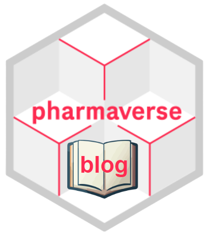

# pharmaverse blog 

## Purpose

The communications working group (CWG) seeks to promote and showcase how R can be used in the Clinical Reporting pipeline through short and informative blog posts.
These posts will be hosted on this [pharmaverse blog](https://pharmaverse.github.io/blog/) and promoted on the pharmaverse slack channels as well as on LinkedIn.

As the CWG is a small team, we hope to make the blog development process easy enough that pharmaverse community members will be able to easily write blog posts with guidance from the CWG team.

## Spirit of a Blog Post

The CWG believes that the following 4 points will help guide the creation of Blog Posts.

-   **Short**
-   **Personalized**
-   **Reproducible**
-   **Readable**

**Short:** Posts should aim to be under a 10 minute read.
We encourage longer posts to be broken up into multiple posts.

**Personalized:** Posts should have a personality!
For example, a person wishing to post on a function in a package needs to differentiate the post from the documentation for function, i.e. we don't want to just recycle the documentation.
How can you add your voice and experience?
A bit of cheeky language is also encouraged.

**Reproducible:** Posts should work with minimal dependencies with data, packages and outside sources.
Every dependency introduced in a post adds some risk to the post longevity.
As package dependencies change, posts should be built in a way that they can be updated to stay relevant.

**Readable:** The CWG sees this site as more of introductory site rather advanced user site.
Therefore, the CWG feels that code should be introduced in a way that promotes readability over complexity.

## What types of posts are allowed on this site?

Overall, we want to stay focus on the Clinical Reporting Pipeline, which we see as the following topics:

1)  Packages in the Clinical Reporting Pipeline
2)  Functions from packages in the Clinical Reporting Pipeline
3)  Wider experiences of using R in the Clinical Reporting Pipeline
4)  Conference experiences and the Clinical Reporting Pipeline

However, it never hurts to ask if you topic might fit into this medium!.

### Minimum Post Requirements

-   A unique image to help showcase the post.
-   Working Code
-   Self-contained data or package data.
-   Documentation of package versions

That is it!
After that you can go wild, but we do ask that it is kept short!

## How can I make a Blog Post

**Step 1:** Reach out to us through [pharmaverse/slack](https://pharmaverse.slack.com) or make an issue on our [GitHub](https://github.com/pharmaverse/blog/issues).

**Step 2:** Branch off `main`

**Step 3:** Create a new Blog Post skeleton using the `create_blog_post.R` script in the `R/` folder.

-   Open the `create_blogpost.R` file.

-   Source the script `help_create_blogpost.R` from within the `create_blogpost.R` file.

-   Enter your information into the `create_post` function.
    Please note that we do not currently allow users to specify their own categories (or `tags`), so you must choose (possibly several) from this list: `c("Metadata", "SDTM", "ADaM", "TLG", "Shiny", "Community", "Conferences", "Submissions", "Technical")`.

-   Running that function will create a subfolder with a quarto file (`*.qmd`) in the `posts/` folder.
    Both should be named based on the supplied `post_date` and `post_name` information.

-   Open the newly created folder and start working within the `*.qmd` file.

**Step 4:** After you have finished your Blog Post, open the `CICD.R` file in the `R/` folder.
Run the script line by line to first check the spelling in your post and then to make sure your code is compatible with our code-style.

**Step 5:** Push to your branch, create a Pull Request, and review the Spirit of the Blog Post in the Pull Request Template.

**Step 6:** Poke us to do a review!

Most importantly:

**Step 7:** Have fun :)

## Tips and Tricks

* You can use the [link](https://cran.r-project.org/web//packages//link/index.html) package to create dynamic links for a function to its package down website in a blog post.  For example,
  instead of doing function_name with markdown syntax for url linking, i.e [link](https://cran.r-project.org/web//packages//link/index.html), you can just do `admiral::derive_vars_dy()`
  and it will create the link in your blog post.  See the raw code in this post [admiral 1.0.0](https://pharmaverse.github.io/blog/posts/2023-12-18_admiral_1_0/admiral_1_0.html) to see
  it in action.

* You can use this code snippet to install all packages needed for the blog site or use the docker image cited below.
```
install.packages(c("jsonlite",
                   "tidyverse",
                   "spelling",
                   "janitor",
                   "diffdf",
                   "admiral",
                   "patchwork",
                   "here",
                   "reactable",
                   "pharmaversesdtm",
                   "metacore",
                   "metatools",
                   "xportr",
                   "pharmaverseadam",
                   "link",
                   "sessioninfo"))
```
## How to Use the `blog` Docker Image for Local Development

Contributors can benefit from using the [`blog` Docker image](https://github.com/pharmaverse/blog/pkgs/container/blog) when creating their blog posts.
This way, contributors don't have to install all dependencies from other blog posts and can solely focus on their own blog post and its dependencies.

Here are the steps to use the blog's Docker image:

1.  Ensure you have [Docker Desktop](https://docs.docker.com/get-docker/) installed.
2.  Start Docker Desktop on your machine.
3.  Perform a Docker pull from the blog's GitHub registry by running this code:

``` bash
docker pull ghcr.io/pharmaverse/blog:latest
```

4.  Clone this `blog` repository and take note of the location of the repo in your local machine.
5.  Update the code below specifying the location of your 'blog' repository and execute the script:

``` bash
docker run --rm -ti -e PASSWORD=yourpassword -p 8787:8787 -v <location of your blog repo>:/home/rstudio/work ghcr.io/pharmaverse/blog
```

Here's an example:

``` bash
docker run --rm -ti -e PASSWORD=yourpassword -p 8787:8787 -v ~/Documents/blog:/home/rstudio/work ghcr.io/pharmaverse/blog
```

This command will run the `blog` Docker image and mount your local folder to the image.

6.  Open http://localhost:8787/ and you should see the RStudio welcome page.
7.  The username will be `rstudio`, and the password is `yourpassword`.
8.  Once logged in, go to the work folder, and you should see the contents of the `blog` repository.
9.  Click the `quarto-blog.Rproj` file to open the project.
10. You can test by opening the `index.qmd` and rendering the document.
11. Quarto should run, and you should be able to see the rendered blog locally.
12. Develop your blog post and re-render as needed.
13. Once complete, you can close the RStudio session, shut down the image, and push your update to the blog repo.

Please note that there is no SSH or git capability in the docker image, so you can't push your update to the repo from the image directly.
To push the update, you would have to do it from your local RStudio or terminal.

A Dockerfile is also provided in this repo if you want to build the image locally and add more functionalities.
