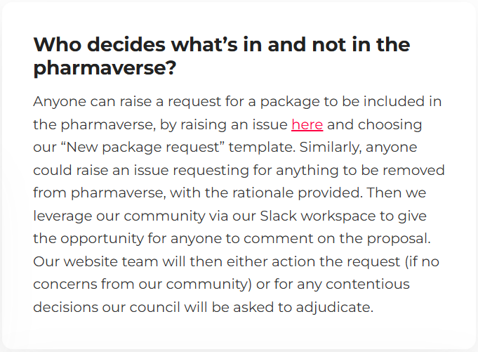

<!--------------- typical setup ----------------->

```{r setup, include=FALSE}
long_slug <- "2026-03-06-pharmaverse-pillar"
```

<!--------------- post begins here ----------------->

## **OS Software Solutions Pillar**

Firstly, if you're reading this wondering what do we mean by a "pillar" then check our introductory blog [here](https://pharmaverse.github.io/blog/posts/2026-02-26-pharmaverse-pillars/pharmaverse-pillars.html).

Our OS Software Solutions pillar aims to ensure the industry has a curated ecosystem of open source solutions\* useful for reporting and submission of clinical data and analyses.

*\* R, python, or other languages*

To achieve this we have agreed on 3 focus areas:

-   *Pharmaverse OSS suite* – oversee what we include/exclude and monitor feedback and sustainability

-   *Our development teams* – offer support, e.g. helping bring more contributors / hackathons

-   *Industry adoption* – advising on pathways to increase industry usage, e.g. continued maintenance of our examples page

### **Pharmaverse OSS suite**

A question we often get asked is who decides what's in and not in the pharmaverse?

We have the following explanation on the FAQ section of our homepage, which shows
how we rely on our community here:



So within the council we see our role here to oversee this process and ensure that
at the heart of things you (our community) remain the ones empowered to decide
on our curated suite of packages.

We do maintain [inclusion criteria](https://pharmaverse.org/contribute/lead/)
to help ensure the quality and integrity of all our recommended software solutions.

### **Our development teams**

We appreciate that maintaining packages to be used across the industry can be
challenging, and often there will be more requests for new features than the
number of people volunteering to help build and test those. So we want to find ways
to help connect would-be contributors with the package development teams who
need them most. If ever you're a package lead and you find yourself in this
situation please don't hesitate to reach out to our council at pharmaverse.council@phuse.global.

Similarly from the perspective of those individuals who are new to open source and looking
to help out, it can be daunting to make such connections and dive into contributing.
If you find yourself in this position, then here's a useful [blog](https://pharmaverse.github.io/blog/posts/2024-03-11_tips_for__first_/tips_for__first__time__contributors.html)
with tips to help you get started. You may also be interested in joining our very
first official hackathon series...

#### **Pharmaverse Hackathons**

One idea we'd like to try out in 2026 is that we want to run a series of hackathon
events for either first time or more season contributors to get involved in a new
open source project. Resources will be provided to help anyone to be able to take
part, no matter if you might be new to topics like R or Git.

Here is our calendar of events:

| Package                                              | Target Date       | Timezone | Sign-up                                                                |
|------------------------------------------------------|-------------------|----------|------------------------------------------------------------------------|
| `{teal}` - \@ R/Medicine conference                  | April 23rd        | PST      | [Link](https://rconsortium.github.io/RMedicine_website/Hackathon.html) |
| `{xportr}`                                           | May 21st          | EST      | _TBA_                                                                  |
| `{aNCA}`                                             | July 16th         | CET      | _TBA_                                                                  |
| `{autoslider}` - \@ R/Pharma conference              | Week of Sept 28th | CST      | _TBA_                                                                  |
| `{gtsummary}` & `{cards/x}` - \@ R/Pharma conference | Week of Sept 28th | PST      | _TBA_                                                                  |
| `{logrx}`                                            | Early November    | EST      | _TBA_                                                                  |

Each hackathon will consist of the following structure:

-   *Week 1 (Preparation)*: We'll host a 60-minute kick-off to introduce the package, a selection of curated issues, and contributor guidelines.

-   *Week 2 (Execution)*: Our 3–4 hour hackathon event will take place, where you'll be able to try out a contribution supported by OS mentors and developers from the package team.

-   *Week 3 (Wrap-Up)*: Any pull requests will be reviewed so you can receive any useful feedback, and then a final office hour session will be offered to conclude and celebrate your contributions. We hope this will be the first step of you wanting to get more involved in pharmaverse!

### **Industry adoption**

Our final commitment is to provide pathways to enable wider industry adoption of
all our solutions. We all have built such an amazing resource under pharmaverse
here, so we want to maximize the benefit for all patients across the world.

So you'll see us actively showcasing pharmaverse OS software solutions in many
different forms, and one such is by active maintenance of our [examples site](https://pharmaverse.github.io/examples/). Please do read more [here](https://pharmaverse.github.io/blog/posts/2025-12-18_pharmaverse/pharmaverse__examples.html)
- this is a wonderful resource for new users, demonstrating how the beauty of open
source is truly in how many solutions come together to form a whole greater than
the sum of the individual parts.

To share an often used quote in this space: *"In open source, we feel strongly
that the future is only won through 1+1 being much more than 2."*

<!--------------- appendices go here ----------------->

```{r, echo=FALSE}
source("appendix.R")
insert_appendix(
  repo_spec = "pharmaverse/blog",
  name = long_slug,
  # file_name should be the name of your file
  file_name = list.files() %>% stringr::str_subset(".qmd") %>% first()
)
```
