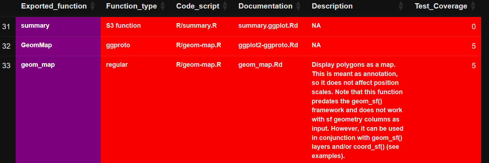
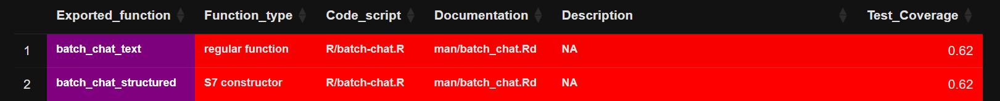

<!--------------- typical setup ----------------->

```{r setup, include=FALSE}
long_slug <- "2026-06-23-risk-assessr-a-data"
```

<!--------------- post begins here ----------------->

{fig-align="center" width="220"}

# Validating R packages, the risk-based way

In pharmaceutical development, the reliability of statistical and TLF
software is a regulatory requirement. For organizations using R in
submission environments, this mandate means a rigorous approach to
validation is needed. `{risk.assessr}` is an open-source tool — built by
the Sanofi/Cytel Validation team and available on CRAN and `pharmaverse`
— that turns package validation into a structured, data-driven workflow.

System validation must support three pillars:

-   **Accuracy** — does the package compute the right answer?
-   **Reproducibility** — does it compute the same answer, every time,
    on every machine?
-   **Traceability** — can you tie each exported function back to a
    specification, a test, and a result?

The [R Validation Hub](https://www.pharmar.org/) classifies R packages
into two tiers when considering accuracy:

-   **Base and recommended (core) packages** — developed by the R
    Foundation and shipped with R itself. These represent the highest
    tier of reliability.
-   **Contributed open-source packages** — developed by anyone in the
    community. These vary significantly in accuracy, robustness, and
    maintenance.

`{risk.assessr}` assigns each assessed package a quantitative risk
profile so that you can decide — with evidence — whether the package is
suitable for exploratory work, for a regulatory submission, or should be
rejected.

## Summary: What does `{risk.assessr}` give you?

-   A single entry point — `risk_assess_pkg()` — that downloads a
    package (or accepts a local `.tar.gz`), installs it, runs
    `R CMD check`, computes test coverage, builds a traceability matrix,
    and harvests metadata from CRAN, Bioconductor, GitHub, and PubMed.
-   A configurable, **rule-based risk engine** (`get_risk_analysis()`)
    whose thresholds live in a JSON file
    (`inst/config/risk-definition.json`) — meaning your validation
    criteria are auditable, editable artefacts.
-   Two complementary reports:
    -   `generate_html_report()` — a rich red/yellow/green dashboard for
        developers and validation engineers.
    -   `write_summary_report()` — a one-page **Approved / Rejected /
        Remediation Needed** summary for sign-off, typically triggered
        by a Validation GitHub Action.
-   Support for the modern R object system landscape: regular, S3, S4,
    S7, R6 and ggproto functions are all classified and traced.
-   A built-in **dependency tree** (`build_dependency_tree()`) so that
    the recursive risk of a package's imports is visible, not hidden.

The rest of this post takes a few deep dives into the parts of
`{risk.assessr}` that most directly support a validation decision.

## How a package gets assessed: the `assess_pkg()` workflow

Before diving in, it helps to see the shape of the workflow. The
user-facing entry point `risk_assess_pkg()` is a thin wrapper that
resolves a package source (a tarball, a CRAN / Bioconductor / internal
repo name, or an interactive file chooser), and then hands off to the
internal controller function `assess_pkg()`:

```{mermaid}
%%| echo: false
flowchart TD
    A[risk_assess_pkg<br/>path / package / file chooser] --> B[set_up_pkg<br/>unpack tarball]
    B --> C[install_package_local]
    C --> D[assess_pkg]
    D --> D1[doc_riskmetric<br/>documentation, news, examples]
    D --> D2[test.assessr::get_package_coverage<br/>test coverage]
    D --> D3[create_traceability_matrix<br/>exports x docs x tests]
    D --> D4[run_rcmdcheck + check_forbidden_notes]
    D --> D5[get_dependencies / get_session_dependencies]
    D --> D6[check_suggested_exp_funcs]
    D --> D7[get_host_package + get_github_data<br/>cran_revdep / bioconductor_reverse_deps<br/>get_cran_total_downloads]
    D1 & D2 & D3 & D4 & D5 & D6 & D7 --> E[get_risk_analysis<br/>apply risk-definition.json]
    E --> F[results, covr_list, tm_list, check_list, risk_analysis]
```

Each of those branches produces a slice of evidence;
`get_risk_analysis()` brings them together and applies your risk rules.
The next sections walk through the most validation- relevant branches.

## Deep dive 1: R CMD check, with three profiles and "forbidden notes"

`R CMD check` is the largest and most comprehensive check in the R
ecosystem — more than 50 individual checks of an R package's structure,
metadata, code, tests, examples and documentation are performed.
`{risk.assessr}` runs it through `rcmdcheck::rcmdcheck()` that the user
can configure: **you choose a check profile**, and **certain notes are
reclassified as errors**.

### Three profiles, picked by `setup_rcmdcheck_args()`

``` r
# the function lives in R/setup_rcmdcheck_args.R
setup_rcmdcheck_args(check_type = "1", build_vignettes = FALSE)
```

| `check_type`  | Profile                 | What it does                                                               |
|--------------|--------------|--------------------------------------------|
| `"1"`         | Basic (default)         | `--no-examples`, `--ignore-vignettes`, `--no-vignettes`, `--no-manual`     |
| `"2"`         | Frugal / no-tests       | As `"1"` plus `--no-tests`. Used by `get_frugal_metrics()` for fast scans. |
| anything else | CRAN-like (`--as-cran`) | Mirrors a CRAN submission check; honours `build_vignettes`.                |

Every profile also sets `_R_CHECK_FORCE_SUGGESTS_=FALSE` so a missing
Suggests dependency does not fail the check the same way it would on a
clean CRAN machine. The check is run with `error_on = "never"`, because
the goal is *evidence*, not a stop signal — a failed package should
still produce a report.

### Reclassifying "forbidden" notes as errors

The vanilla `R CMD check` is famously lenient: several issues that
should be deal-breakers in a validated environment land as mere `NOTE`s.
`check_forbidden_notes()` rescans the notes and promotes the dangerous
ones to errors, mimicking a CRAN - style check:

``` r
forbidden_patterns <- c(
  "'.*' import not declared from",
  "Namespace in Imports field not imported from",
  "no visible global .+ definition"
)
```

In other words, packages that quietly reach into namespaces they didn't
declare, or rely on globals the parser can't resolve, will be scored as
if they had failed outright. The scoring itself is a weighted sum:

``` r
# core_metrics.R, run_rcmdcheck()
sum_vars         <- c(notes = length(notes), warnings = length(warnings), errors = length(errors))
score_weightings <- c(notes = 0.10,           warnings = 0.25,            errors = 1.00)
check_score      <- 1 - min(sum(score_weightings * sum_vars), 1)
```

The result is a `check_score` in `[0, 1]`: `1` means a perfectly clean
check, `0` means at least one error (or four warnings, or ten notes).

## Deep dive 2: `get_risk_analysis()` — rules you can version-control

Raw metrics are not decisions. `get_risk_analysis()` turns numbers (and
licence strings) into **Low / Medium / High** risk levels, using a
config file that ships with the package:

``` r
system.file("config", "risk-definition.json", package = "risk.assessr")
```

Each entry in that JSON file maps one **key** in the flattened results
to a set of thresholds:

``` json
{
  "label": "code coverage",
  "id": "code_coverage",
  "key": "code_coverage",
  "thresholds": [
    { "level": "high",   "max": 0.6 },
    { "level": "medium", "max": 0.8 },
    { "level": "low",    "max": 1   }
  ]
}
```

The defaults that ship with `{risk.assessr}` cover the metrics most
validation teams care about:

| Risk dimension         | Key                          | Default thresholds (Low / Medium / High)                     |
|----------------|----------------|-----------------------------------------|
| Dependency count       | `dependencies_count`         | ≤ 20 / ≤ 40 / \> 40                                          |
| Version deprecation    | `later_version`              | ≤ 3 later releases / \> 3                                    |
| Code coverage          | `code_coverage`              | \> 80% / 60–80% / ≤ 60%                                      |
| Popularity (downloads) | `total_download`             | \> 50M / 3.5M–50M / ≤ 3.5M                                   |
| Licence                | `license`                    | MIT/Apache / GPL/LGPL/Artistic / AGPL, SSPL, NOTAVAILABLE, … |
| Reverse dependencies   | `reverse_dependencies_count` | \> 15 / 6–15 / ≤ 5                                           |
| Documentation breadth  | `documentation_score`        | \> 6 indicators / 4–6 / ≤ 3                                  |
| Examples + Rd coverage | `has_ex_docs_score`          | \> 80% / 60–80% / ≤ 60%                                      |
| `R CMD check`          | `cmd_check`                  | = 1.0 / 0.0–0.8 / 0                                          |

### Creating your own risk profile

These defaults are sensible, but users can set their own rules and
values. You can override them globally for an R session in one of two
ways:

```{r, echo=FALSE}
library(risk.assessr)

strict_coverage_config <- list(
  list(
    label = "code coverage",
    id = "code_coverage",
    key = "code_coverage",
    thresholds = list(
      list(level = "high", max = 0.9999),
      list(level = "low", max = NULL)
    )
  ),
  list(
    label = "popularity",
    id = "popularity",
    key = "last_month_download",
    thresholds = list(
      list(level = "high", max = 21200000),
      list(level = "medium", max = 11200000),
      list(level = "low", max = NULL)
    )
  )
)
```

```{r, eval=FALSE}
# Option A: an in-memory R list
options(risk.assessr.risk_definition = strict_coverage_config)

# Option B: point at an external JSON file (recommended for governance)
options(risk.assessr.risk_definition = "config/risk-definition-internal.json")

result <- risk_assess_pkg(package = "stringr")
str(result$risk_analysis)
```

Storing the rules in JSON creates an audit trail: your validation policy
has a **versioned artefact** that can be examined by reviewers or
management.

## Deep dive 3: documentation metrics that look beyond the README

Good documentation is a leading indicator of long-term reliability.
`doc_riskmetric()` rolls several signals into a single `doc_scores`
list, each of which feeds the risk engine:

-   **Standard roxygen / Rd documentation.**
    `assess_exported_functions_docs()` walks `tools::Rd_db()`, resolves
    every exported function to its `.Rd` page — supporting shared topics
    via `@rdname` and multiple `\alias{}` entries — and produces
    `has_docs_score`, the fraction of exported functions that have an Rd
    page.
-   **Worked examples.** `assess_examples()` extracts the `\examples{}`
    and `\example{}` sections (including content wrapped in `\dontrun{}`
    and `\donttest{}`) and reports `example_score`, the fraction of
    exported functions that have an example. `\dontrun{}` blocks still
    count — what we are measuring is *intent to demonstrate*, not
    whether the example runs on a clean CRAN box.
-   **Family-style documentation.** The HTML report explicitly checks
    whether exported functions are grouped through roxygen `@family`
    tags, surfacing packages that document related functions together (a
    strong signal of curated APIs).
-   **`DESCRIPTION` health.** `assess_description_file_elements()`
    reports whether the package declares a `BugReports` URL, a
    maintainer, a website, and a source-control link. Source control
    detection is intentionally broad — `github.com`, `gitlab.com`
    (including self-hosted GitLab), Bitbucket, R-Forge, Codeberg,
    SourceForge, Sourcehut, Bioconductor, and academic `.ac.uk` /
    `.edu.au` URLs all count. If the `URL` field is empty, `BugReports`
    is used as a fallback.
-   **NEWS, and *current* NEWS.** `assess_news()` finds `NEWS`,
    `NEWS.md`, or `NEWS.Rd` anywhere in the target package (package
    root, `doc/`, `vignettes/`, and recursively under `inst/`).
    `assess_news_current()` then goes one step further and checks that
    the NEWS file actually mentions the **version under assessment** —
    catching the classic "the NEWS file exists, but was last updated
    three releases ago" failure mode.
-   **Vignettes and codebase size.** `assess_vignettes()` reports
    presence; `assess_size_codebase()` recursively walks `R/` to give a
    lines-of-code count (after stripping headers, comments, and blank
    lines) as a proxy for surface area.

The composite `has_ex_docs_score` is just the mean of `example_score`
and `has_docs_score`, giving a single number for "are exported functions
both documented and demonstrated?".

## Deep dive 4: traceability matrix — function type *and* function status

`create_traceability_matrix()` is an important element for examining
packages for *accuracy, reproducibility, traceability*. For every
exported function it produces a row linking:

-   the function name (and its class, for methods),
-   the function **type** (regular, S3 generic, S3 method, S3
    generic+method, S4 generic, S4 method, S7 generic, S7 class, S7
    constructor, R6 class, ggproto class, …),
-   the function **description** parsed from its Rd,
-   the documentation file in `man/`,
-   the source script in `R/`,
-   the per-script test coverage percentage from `{test.assessr}` /
    `{covr}`,
-   the test scripts that exercise the function.

### Classifying every flavour of R function

`get_exports()` and `classify_function_body()` together handle the
modern R function types (regular and Object Oriented Programming (OOP)
functions. A selection from the production code:

``` r
if (inherits(obj, "S7_generic"))   return(list(name = f, class = NA, type = "S7 generic"))
if (inherits(obj, "S7_class"))     return(list(name = f, class = NA, type = "S7 class"))
if (grepl("S7::new\\(|S7::new_object\\(", body_text))
                                   return(list(name = f, class = NA, type = "S7 constructor"))
if (methods::isGeneric(generic_clean))
                                   row$function_type <- "S4 method, S4 generic"
```

S3 methods are parsed straight out of `NAMESPACE` lines like
`S3method(print, foo)`, and the classifier later upgrades the label if
it finds (or fails to find) `UseMethod()` calls in the body. R6 and
ggproto classes have dedicated extractors so that **every method body**
— not just the top-level constructor — is available for downstream
pattern matching.

This matters in regulated work because validation auditors rarely accept
"exported function" as a single bucket: an S4 generic is documented and
tested very differently from an R6 method, and an S7 constructor is
something else again.

The following are examples of traceability matrices report:

First, an example from ggplot2 version 3.5.1:



This shows 3 functions; each with a different function type.

Second, an example from ellmer version 0.3.0:



### Fine-grained matrices: by test coverage *and* by function status

Once the master matrix is built, `fine_grained_tms()` filters it into
seven views, each of which lands in the HTML report as a tab:

``` r
tm_list$coverage$high_risk        # coverage_percent <= 60 or NA
tm_list$coverage$medium_risk      # 60 < coverage_percent < 80
tm_list$coverage$low_risk         # coverage_percent >= 80

tm_list$function_type$defunct       # body / docs mention defunct / deprecated / superseded
tm_list$function_type$imported      # docs / scripts mention "imported"
tm_list$function_type$rexported     # docs / scripts mention "re-exported" / "reexports"
tm_list$function_type$experimental  # docs / scripts mention "experimental"
```

The result is a matrix that answers the question a validation reviewer
actually asks: not "how many functions are tested?" but **"which
functions are tested, which are deprecated, and which are still
experimental?"** — separately, per package, on one screen.

## Deep dive 5: where popularity comes from

Popularity can provide guidance about packages' use in general.
`{risk.assessr}` harvests it from four independent sources, so a package
with high downloads, active GitHub commits, *and* peer-reviewed
citations earns its rating instead of relying on a single ranking.

| Source       | Function(s)                                                    | What it tells you                                                                                                                                |
|---------------|--------------------------|-------------------------------|
| CRAN         | `get_cran_total_downloads()`, `get_package_download_cran()`    | Total + daily download counts via `cranlogs.r-pkg.org`.                                                                                          |
| CRAN         | `cran_revdep()` (with cached `cran_packages()`)                | Reverse dependencies on CRAN.                                                                                                                    |
| Bioconductor | `bioconductor_reverse_deps()`, `fetch_bioconductor_releases()` | Reverse dependencies and release metadata.                                                                                                       |
| GitHub       | `get_github_data()`                                            | Stars, forks, open issues, commits in the last 30 days, and average issue close time, via the GitHub REST API (PAT-friendly via `GITHUB_TOKEN`). |
| PubMed       | `get_pubmed_count()`, `get_pubmed_by_year()`                   | Citation counts via NCBI E-utilities — useful evidence for statistical / pharmacometric packages.                                                |

A subtle but important detail: `cran_packages()` is cached for 30
minutes in a package-level environment, so a typical scan does not
hammer the CRAN metadata endpoint, and repeated `cran_revdep()` calls in
the same session return identical snapshots — important for reproducible
test runs.

## Deep dive 6: the dependency tree — recursive risk, made visible

A package is only as safe as its imports. `build_dependency_tree()`
recursively walks the `Imports` field of a package's `DESCRIPTION`,
stopping at base / recommended packages or at a user-controlled
`max_level`:

```{r, eval=FALSE}
tree <- build_dependency_tree("ggplot2", get_license = TRUE, max_level = 5)
```

What you get back is a nested list whose leaves are either `"base"`
(terminal) or another node with `version` and (optionally) per-package
`license` fields. That recursive licence collection matters: a
permissively-licensed top-level package can still drag in a GPL-only
dependency several levels down — and `{risk.assessr}` will provide
details in the report.

For lock-file-driven projects, `risk_assess_pkg_lock_files()` plays the
same role for `renv.lock` and `pak.lock`, so a project's *resolved*
environment can be scored, not just an individual package.

## Reporting: two artefacts, two audiences

`{risk.assessr}` generates two complementary reports:

-   **`generate_html_report()`** — the technical view. Each metric is
    rendered with a red / yellow / green badge corresponding to High /
    Medium / Low risk. Reverse-dependency lists, download charts,
    dependency trees, and the seven traceability matrix tabs are all
    there.

-   **`write_summary_report()`** — the one-page sign-off. It renders an
    `Approved`, `Rejected`, or `Remediation Needed` recommendation,
    derived from the risk profile, with enough context for a validation
    engineer to apply critical judgement. Typically driven by a
    Validation GitHub Action so that every package, every version,
    leaves a paper trail.

A typical end-to-end call looks like:

```{r, eval=FALSE}
library(risk.assessr)

# Score a CRAN package, with all defaults
result <- risk_assess_pkg(package = "stringr")

# Or score a local tarball
result <- risk_assess_pkg(path = "path/to/your/package.tar.gz")

# Generate the dashboard
generate_html_report(result, output_dir = "reports")

# Generate the one-page sign-off
write_summary_report(result, output_dir = "reports")
```

## Final takeaways

`{risk.assessr}` is a **scaffold for evidence-based validation**. Its
strengths come from a deliberate set of design choices:

-   Run `R CMD check` with a customisable profile, then upgrade
    silent-but-dangerous notes into errors.
-   Score documentation against multiple metrics, including whether the
    NEWS file actually mentions *the version under review*.
-   Build a traceability matrix that respects S3, S4, S7, R6 and ggproto
    — and slices it by both coverage and function status (defunct,
    imported, re-exported, experimental).
-   Aggregate popularity across CRAN, Bioconductor, GitHub, and PubMed.
-   Make recursive dependency and licence risk visible.
-   Keep the rules that turn metrics into decisions in a versioned JSON
    file — so the validation policy itself is auditable.

The result is an audit trail that any validation reviewer can analyse
and sign off.

`{risk.assessr}` is community-driven; if you have ideas, find an edge
case, or want to contribute a new metric, please open an issue or a PR
on [GitHub](https://github.com/pharmaverse/risk.assessr/issues). We'd
love to hear from you.

<!--------------- appendices go here ----------------->

```{r, echo=FALSE}
source("appendix.R")
insert_appendix(
  repo_spec = "pharmaverse/blog",
  name = long_slug,
  # file_name should be the name of your file
  file_name = list.files() %>% stringr::str_subset(".qmd") %>% first()
)
```
