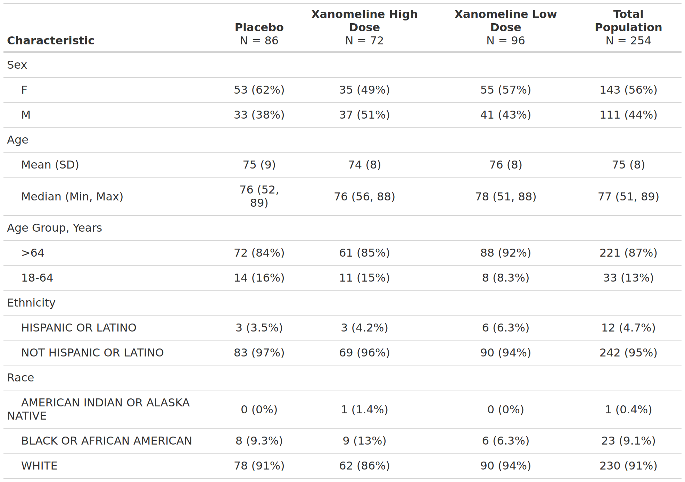

<!--------------- typical setup ----------------->

```{r setup, include=FALSE}
long_slug <- "2026-09-23-cardinal-is-on-cran"
```

<!--------------- post begins here ----------------->

A few years ago [{cardinal}](https://pharmaverse.github.io/cardinal/) started life as a
quarto catalog of copy-paste template scripts — a cross-company effort (Boehringer
Ingelheim, Moderna, Roche, Sanofi and friends) to open-source a harmonized set of the FDA
safety tables everyone in clinical reporting keeps rebuilding from scratch.

It just grew up. **cardinal is now on CRAN** — installable, versioned, dependency-managed:

```{r install, eval=FALSE}
install.packages("cardinalfda")
```

Yes, the package is `cardinalfda` on CRAN (plain `cardinal` was already taken). Same
initiative, same website, now a proper release you can pin in a lockfile and trust to still
install next year.

## What changed under the hood

If you looked at cardinal a while back, the tables were `{rtables}`. That's no longer the
engine. The catalog has moved to the **`{gtsummary}` + `{cards}`/`{cardx}` + `{crane}`**
stack:

- **`{gtsummary}`** builds the table,
- **`{cards}`** / **`{cardx}`** build the **ARD** (Analysis Results Dataset) behind it,
- **`{crane}`** supplies the pharma-specific bits (e.g. `tbl_listing()` for listings).

And that middle point is the part I'm most excited about: **every cardinal table now comes
with an ARD.** More on that below.

## The anatomy of a cardinal template

The nicest thing about the new layout is that every template tells the same story — and it
maps onto how a statistical programmer actually thinks. Each catalog page has the same four
tabs: **Table Preview → Setup → Build Table → Build ARD**. Let's walk FDA Table 2 (Baseline
Demographic and Clinical Characteristics, Safety Population) through it.

### 1. The IG — the FDA Integrated Guide

cardinal's templates are drawn from the FDA's **Standard Safety Tables and Figures Integrated
Guide** (the "IG"), and are indexed by its table numbers — `fda-table_02` *is* IG Table 2.
The IG is the specification: it says exactly what the table should contain — the rows, the
summary statistics, the population, the footnotes. So there's never any doubt about *what*
the output is supposed to be.

### 2. The output snapshot — the preview

Every catalog page opens with a **Table Preview** — a snapshot of the target output, the
"here's what we're building" picture. It's the contract between the IG spec and the code.



### 3. The actual code

Then the part programmers came for — the **actual, runnable code**. cardinal ships each IG
template as a self-contained script, so nothing is a black box: the template gives you the
layout, you supply your ADaM data. Here is the real `fda-table_02` template, run against the
public `{pharmaverseadam}` ADSL:

```{r build-table, message=FALSE, warning=FALSE}
library(cardinalfda)
library(dplyr)

adsl <- pharmaverseadam::adsl |>
  # removing screen failure observations
  filter(TRT01A != "Screen Failure")

tbl <- adsl |>
  dplyr::filter(SAFFL == "Y") |>
  gtsummary::tbl_summary(
    by = dplyr::all_of("TRT01A"),
    include = dplyr::all_of(c("SEX", "AGE", "AGEGR1", "ETHNIC", "RACE")),
    type = gtsummary::all_continuous() ~ "continuous2",
    statistic = list(
      gtsummary::all_continuous() ~ c(
        "{mean} ({sd})",
        "{median} ({min}, {max})"
      ),
      gtsummary::all_categorical() ~ "{n} ({p}%)"
    ),
    label = list(AGEGR1 = "Age Group, Years")
  ) |>
  gtsummary::add_overall(last = TRUE, col_label = "**Total Population**  \nN = {N}") |>
  gtsummary::remove_footnote_header(columns = dplyr::everything())
```

### 4. The real output

Because the template is real code over real (public) data, the last step is just to print
it — and *that same table* is what you'd drop into your report:

```{r output}
tbl
```

Prefer not to read the whole script? Every template is also runnable in one line, which
sources the shipped script and hands you back the built objects:

```{r run-template, eval=FALSE}
env <- run_template("fda-table_02")
env$tbl # the gtsummary table
env$ard # the ARD (see below)
```

## The bit I like most: an ARD falls out for free

An **ARD** (Analysis Results Dataset) is the tidy, machine-readable version of a table —
every statistic as a row, before any formatting. It's the emerging CDISC direction for
analysis results, and it's what makes results reusable, comparable and reviewable rather than
locked inside a rendered table.

With the `{cards}`-based approach, you don't build the ARD separately — it's gathered
straight from the table you already made:

```{r build-ard}
ard <- gtsummary::gather_ard(tbl)
ard$tbl_summary |>
  dplyr::select(dplyr::any_of(
    c("group1", "group1_level", "variable", "stat_name", "stat")
  )) |>
  head(8)
```

Same numbers as the table, now as data you can filter, diff against a previous run, or feed
into a meta-analysis. Table *and* ARD, from one template — that's the direction cardinal is
heading.

## Try it, and come help

Install it, run a template, and if you spot a table your team builds differently, that's an
invitation — cardinal is a collaboration, and new templates are exactly the kind of
contribution the initiative wants. The
[cardinal website](https://pharmaverse.github.io/cardinal/) has the full catalog, and the
[pharmaverse examples site](https://pharmaverse.github.io/examples/) is a great next stop for
seeing these packages used end to end.

<!--------------- appendices go here ----------------->

```{r, echo=FALSE}
source("appendix.R")
insert_appendix(
  repo_spec = "pharmaverse/blog",
  name = long_slug,
  # file_name should be the name of your file
  file_name = list.files() %>% stringr::str_subset(".qmd") %>% first()
)
```
